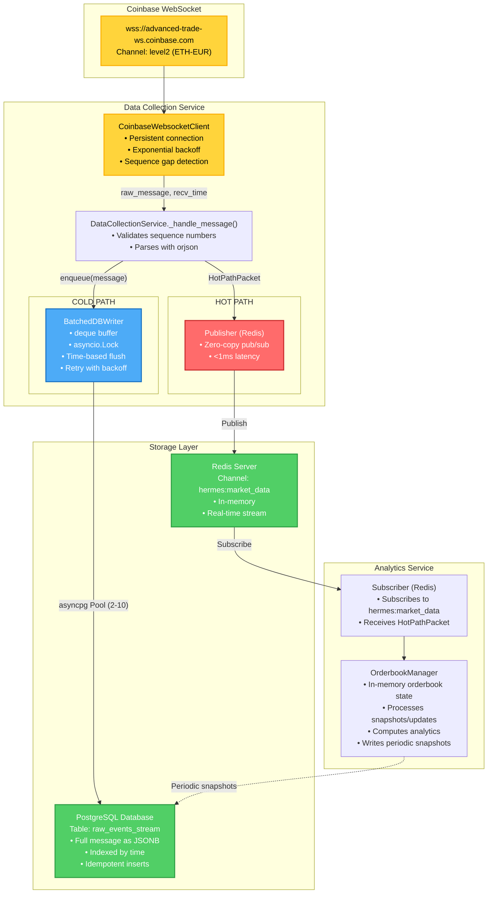

# Hermes Market Engine - Current Architecture

**Last Updated**: 2025-12-03
**Status**: Cold Path Implementation Complete

---

## Table of Contents
1. [System Overview](#1-system-overview)
2. [Architecture](#2-architecture)
3. [Data Collection Service](#3-data-collection-service)
4. [Analytics Service](#4-analytics-service)
5. [Database Schema](#5-database-schema)
6. [Configuration](#6-configuration)
7. [Deployment](#7-deployment)

---

## 1. System Overview

Hermes Market Engine is a high-performance market data platform that ingests live orderbook data from Coinbase Advanced Trade WebSocket API and provides real-time analytics through a dual-path architecture:

- **Hot Path**: Real-time message streaming via Redis pub/sub for immediate analytics
- **Cold Path**: Batched database writes for persistence, replay, and historical analysis

### Key Technologies
- **Python 3.12+** with asyncio
- **PostgreSQL** for persistent storage
- **Redis** for real-time pub/sub
- **asyncpg** for database connection pooling
- **websockets** for Coinbase WebSocket client
- **Pydantic** for data validation and configuration

---

## 2. Architecture

### 2.1 System Diagram



### 2.2 Design Principles

#### Separation of Concerns
- **Data Collection**: Isolated from business logic, only concerned with ingestion
- **Analytics**: Independent of data source, consumes standardized messages
- **Storage**: Dual-path optimized for different access patterns

#### Performance Optimizations
- **Hot Path**: Zero-copy Redis pub/sub for <1ms latency to analytics
- **Cold Path**: Batched writes reduce database load by 1000x
- **Thread Safety**: asyncio.Lock with minimal hold time
- **Buffer Overflow Protection**: deque with maxlen drops oldest messages automatically

#### Reliability
- **Sequence Gap Detection**: Automatic restart on missing messages
- **Exponential Backoff Retry**: 3 attempts (1s, 2s, 4s delays)
- **Graceful Shutdown**: Ordered cleanup flushes remaining data
- **Idempotent Writes**: ON CONFLICT DO NOTHING handles duplicates

---

## 3. Data Collection Service

**Location**: `src/data_collection/ingestor.py`

### 3.1 Components

#### CoinbaseWebsocketClient
- **Purpose**: Maintain persistent WebSocket connection to Coinbase
- **Responsibilities**:
  - Subscribe to level2 channel for specified product_id
  - Handle connection lifecycle (connect, disconnect, reconnect)
  - Exponential backoff on connection failures (1s → 2s → 4s → 8s)
  - Pass raw messages to callback handler
- **Key Features**:
  - `max_size=None`: No message size limit
  - `ping_interval=None`: Disable automatic pings (Coinbase handles keep-alive)

#### DataCollectionService
Main orchestrator for the data collection pipeline.

**Initialization** (`__init__`):
```python
self.connection_id = uuid4()  # Unique ID for this service instance
self.sequence_tracker = -1     # Track Coinbase sequence numbers
self.redis_publisher = Publisher()
self.ws_client: CoinbaseWebsocketClient | None = None
self.db_pool: asyncpg.Pool | None = None
self.db_writer: BatchedDBWriter | None = None
```

**Lifecycle Methods**:

1. `initialise()`:
   - Connect to Redis
   - Create PostgreSQL connection pool
   - Initialise BatchedDBWriter
   - Create CoinbaseWebsocketClient

2. `start()`:
   - Start BatchedDBWriter background flush task
   - Start WebSocket client connection

3. `stop()`:
   - Stop WebSocket (no more incoming messages)
   - Stop BatchedDBWriter (flushes remaining buffer)
   - Close database pool
   - Disconnect from Redis

#### Message Processing (`_handle_message`)

```python
async def _handle_message(self, raw_message: str | bytes, recv_time: float) -> None:
    # 1. Parse with orjson for performance
    data = orjson.loads(raw_message)

    # 2. Skip subscription confirmations
    if data.get("channel") == "subscriptions":
        self.sequence_tracker = data["sequence_num"]
        return

    # 3. Handle error messages
    if data.get("type") == "error":
        logger.error("WebSocket error: %s", data.get("message", data))
        return

    # 4. Validate and parse into CoinbaseMessage
    message = CoinbaseMessage(**data)

    # 5. Sequence gap detection
    if self.sequence_tracker >= 0:
        gap = message.sequence_num - self.sequence_tracker - 1

        if gap > 1:  # Gap detected, restart connection
            logger.error("SEQUENCE GAP DETECTED! Expected %s, got %s", ...)
            await self.ws_client.stop()
            return

        if gap < 0:  # Stale message, skip
            logger.warning("Stale message: %s < %s", ...)
            return

    self.sequence_tracker = message.sequence_num

    # 6. HOT PATH: Publish to Redis
    hot_packet = HotPathPacket(
        ts_ingest=recv_time,
        connection_id=str(self.connection_id),
        payload=message
    )
    await self.redis_publisher.publish(hot_packet)

    # 7. COLD PATH: Enqueue for batched DB write
    if self.db_writer:
        await self.db_writer.enqueue(message, recv_time)
```

### 3.2 BatchedDBWriter

**Purpose**: Batch PostgreSQL writes to reduce database load while maintaining data integrity.

**Architecture**:
```python
class BatchedDBWriter:
    def __init__(
        self,
        pool: asyncpg.Pool,          # Shared connection pool
        connection_id: str,          # Service instance UUID
        batch_interval: float,       # Seconds between flushes (default: 10.0)
        batch_size: int,             # Max messages per batch (default: 1000)
        max_retries: int,            # Retry attempts (default: 3)
    ):
        # Thread-safe buffer with overflow protection
        self._buffer: deque[dict[str, Any]] = deque(maxlen=batch_size * 2)
        self._buffer_lock = asyncio.Lock()
        self._flush_task: asyncio.Task | None = None
        self._running = False
```

**Key Methods**:

1. **`enqueue(message, received_at)`**:
   - Thread-safe append to buffer
   - Transforms CoinbaseMessage to database row format
   - Drops oldest message if buffer exceeds 2x batch_size

2. **`_periodic_flush()`**:
   - Background asyncio task
   - Sleeps for `batch_interval` seconds
   - Calls `_flush()` to write batch to database
   - Continues until `_running = False`

3. **`_flush()`**:
   - Atomically extract up to `batch_size` messages from buffer
   - Call `_execute_batch_with_retry()` outside the lock
   - Minimizes lock hold time to prevent blocking enqueue operations

4. **`_execute_batch_with_retry(batch)`**:
   - Exponential backoff: wait_time = 2^attempt seconds
   - Attempts: 0 (1s delay), 1 (2s delay), 2 (4s delay)
   - After 3 failures, log error and drop batch
   - Uses `executemany()` for efficient batch insert

5. **`_transform_message(message, received_at)`**:
   - Extract `event_type` from first event (snapshot/update)
   - Extract `product_id` from first event
   - Serialise full message to JSONB using orjson
   - Convert Unix timestamp to timestamptz

**SQL Insert Statement**:
```sql
INSERT INTO raw_events_stream (
    connection_id, sequence_num, product_id, channel,
    exchange_timestamp, received_at, event_type, raw_message
) VALUES ($1, $2, $3, $4, $5, $6, $7, $8)
ON CONFLICT (connection_id, product_id, sequence_num) DO NOTHING
```

### 3.3 Expected Behavior

#### Normal Operation
```
[INFO] Initializing Data Collection Service (ID: a1b2c3d4-...)
[INFO] PostgreSQL connection pool created
[INFO] BatchedDBWriter started (flush interval: 10.0s)
[INFO] Data Collection Service started
[DEBUG] Flushing 847 messages to database
[DEBUG] Successfully wrote 847 messages to database
```

#### Transient Error with Recovery
```
[ERROR] Database write failed (attempt 1/3): connection timeout. Retrying in 1s...
[DEBUG] Successfully wrote 1000 messages to database
```

#### Max Retries Exceeded
```
[ERROR] Database write failed (attempt 3/3): connection refused. Retrying in 4s...
[ERROR] Max retries reached. Dropping batch of 1000 messages
```

#### Graceful Shutdown
```
[INFO] Stopping Data Collection Service...
[INFO] Stopping BatchedDBWriter...
[DEBUG] Flushing 237 messages to database
[DEBUG] Successfully wrote 237 messages to database
[INFO] BatchedDBWriter stopped
[INFO] Database pool closed
[INFO] Data Collection Service stopped
```

---

## 4. Analytics Service

**Location**: `src/analytics/` (implementation in progress)

### 4.1 Components

#### Subscriber (Redis)
- **Purpose**: Consume real-time messages from Hot Path
- **Subscribes to**: `hermes:market_data` channel
- **Receives**: `HotPathPacket` with metadata (ts_ingest, connection_id) and payload

#### OrderbookManager
- **Purpose**: Maintain in-memory orderbook state
- **Responsibilities**:
  - Process snapshot events (full orderbook initialization)
  - Process update events (incremental changes)
  - Compute real-time analytics:
    - Best bid/ask
    - Spread
    - Midprice
    - Orderbook imbalance
    - VWAP (weighted average)
  - Write periodic snapshots to `orderbook_snapshot` table

---

## 5. Database Schema

**Location**: `db/schema.sql`

### 5.1 Table: raw_events_stream

**Purpose**: Cold Path storage for all raw WebSocket messages

```sql
CREATE TABLE IF NOT EXISTS raw_events_stream (
    -- Unique internal primary key
    id BIGSERIAL PRIMARY KEY,

    -- Service instance identifier (UUID generated on each connection)
    connection_id UUID NOT NULL,

    -- Exchange-provided sequence number for ordering
    sequence_num BIGINT NOT NULL,

    -- Trading pair (e.g., 'ETH-EUR')
    product_id TEXT NOT NULL,

    -- Channel the event came from (e.g., 'level2', 'subscriptions')
    channel TEXT NOT NULL,

    -- Exchange-provided timestamp (when the event occurred)
    exchange_timestamp TIMESTAMPTZ NOT NULL,

    -- Server timestamp (when the message was received)
    received_at TIMESTAMPTZ NOT NULL DEFAULT NOW(),

    -- Event type: 'snapshot' or 'update'
    event_type TEXT NOT NULL,

    -- Full, raw JSON payload for replay and debugging
    raw_message JSONB NOT NULL,

    -- Idempotency constraint
    CONSTRAINT ws_events_sequence_unique
        UNIQUE (connection_id, product_id, sequence_num)
);
```

### 5.2 Indexes

```sql
-- Primary query pattern: Get events for a product in time range
CREATE INDEX idx_raw_events_product_time
    ON raw_events_stream(product_id, exchange_timestamp DESC);

-- For sequence gap analysis and replay
CREATE INDEX idx_raw_events_sequence
    ON raw_events_stream(connection_id, sequence_num);

-- For channel-specific queries (excludes noise from 'subscriptions')
CREATE INDEX idx_raw_events_channel
    ON raw_events_stream(channel)
    WHERE channel != 'subscriptions';

-- For time-based queries (analytics, cleanup jobs)
CREATE INDEX idx_raw_events_ingest_time
    ON raw_events_stream(ingest_timestamp DESC);
```

### 5.3 Table: orderbook_snapshot

**Purpose**: Periodic snapshots of reconstructed orderbook state

```sql
CREATE TABLE IF NOT EXISTS orderbook_snapshot (
    id BIGSERIAL PRIMARY KEY,
    product_id TEXT NOT NULL,
    side TEXT NOT NULL CHECK (side IN ('bid', 'ask')),
    price NUMERIC(20, 8) NOT NULL,
    quantity NUMERIC(20, 8) NOT NULL,
    snapshot_time TIMESTAMPTZ NOT NULL DEFAULT NOW(),
    sequence_num BIGINT,

    -- Unique price levels per snapshot
    CONSTRAINT unique_snapshot_level
        UNIQUE (product_id, snapshot_time, side, price)
);

-- Get latest snapshot for a product
CREATE INDEX idx_orderbook_snapshot_latest
    ON orderbook_snapshot(product_id, snapshot_time DESC);

-- For time-range queries
CREATE INDEX idx_orderbook_snapshot_time
    ON orderbook_snapshot(snapshot_time DESC);
```

---

## 6. Configuration

**Location**: `src/config.py`

### 6.1 Settings Class (Pydantic)

```python
class Settings(BaseSettings):
    # Database Connection
    db_user: str = Field(default="postgres", alias="DB_USER")
    db_name: str = Field(default="hermes_market_engine", alias="DB_NAME")
    db_password: str = Field(default="", alias="DB_PASSWORD")
    db_host: str = Field(default="localhost")
    db_port: int = Field(default=5432)

    # Coinbase WebSocket
    coinbase_ws_url: str = "wss://advanced-trade-ws.coinbase.com"
    product_id: str = Field(default="ETH-EUR")
    channel: str = Field(default="level2")

    # Redis Pub/Sub (Hot Path)
    redis_url: str = "redis://localhost:6379"
    redis_channel: str = "hermes:market_data"

    # Cold Path (Database Batching)
    db_batch_interval_seconds: float = Field(default=10.0, alias="DB_BATCH_INTERVAL_SECONDS")
    db_batch_size: int = Field(default=1000, alias="DB_BATCH_SIZE")
    db_pool_min_size: int = Field(default=2, alias="DB_POOL_MIN_SIZE")
    db_pool_max_size: int = Field(default=10, alias="DB_POOL_MAX_SIZE")
    db_max_retry_attempts: int = Field(default=3, alias="DB_MAX_RETRY_ATTEMPTS")

    # Logging
    log_level: str = Field(default="INFO")

    model_config = SettingsConfigDict(env_file=".env")

settings = Settings()
```

### 6.2 Environment Variables (.env)

```bash
# Database
DB_USER=postgres
DB_PASSWORD=your_password
DB_NAME=hermes_market_engine

# Cold Path Tuning
DB_BATCH_INTERVAL_SECONDS=10.0  # Flush every 10 seconds
DB_BATCH_SIZE=1000               # Max 1000 messages per batch
DB_POOL_MIN_SIZE=2               # Minimum 2 connections in pool
DB_POOL_MAX_SIZE=10              # Maximum 10 connections in pool
DB_MAX_RETRY_ATTEMPTS=3          # Retry up to 3 times
```

---

## 7. Deployment

### 7.1 Service Startup Script

**Location**: `scripts/main.sh`

```bash
#!/bin/bash

# Get the project root directory
PROJECT_ROOT="$(cd "$(dirname "${BASH_SOURCE[0]}")/.." && pwd)"

# Set PYTHONPATH to include project root
export PYTHONPATH="${PROJECT_ROOT}:${PYTHONPATH}"

# Start both services in background
uv run scripts/run_collector.py &
COLLECTOR_PID=$!

uv run scripts/run_analytics.py &
ANALYTICS_PID=$!

echo "Services started: Collector=$COLLECTOR_PID, Analytics=$ANALYTICS_PID"

# Trap signals for graceful shutdown
trap "kill $COLLECTOR_PID $ANALYTICS_PID; wait" SIGINT SIGTERM

wait
```

### 7.2 Prerequisites

1. **PostgreSQL**:
   ```bash
   psql -U postgres -d hermes_market_engine -f db/schema.sql
   ```

2. **Redis**:
   ```bash
   redis-server
   ```

3. **Python Dependencies**:
   ```bash
   uv sync
   ```

### 7.3 Running Services

```bash
# Start both services
bash scripts/main.sh

# Or run individually
uv run scripts/run_collector.py
uv run scripts/run_analytics.py
```

### 7.4 Monitoring

**Check database ingestion**:
```sql
-- Count messages in last 5 minutes
SELECT COUNT(*), MAX(received_at)
FROM raw_events_stream
WHERE received_at > NOW() - INTERVAL '5 minutes';

-- Check sequence continuity
SELECT connection_id, product_id,
       MIN(sequence_num) as min_seq,
       MAX(sequence_num) as max_seq,
       COUNT(*) as total_messages
FROM raw_events_stream
GROUP BY connection_id, product_id;
```

**Check Redis stream**:
```bash
redis-cli
> MONITOR
# Watch for "hermes:market_data" publishes
```

---

## 8. Performance Characteristics

### 8.1 Hot Path (Redis)
- **Latency**: <1ms from WebSocket receive to Redis publish
- **Throughput**: 1000+ messages/second
- **Reliability**: Best-effort (no persistence)

### 8.2 Cold Path (PostgreSQL)
- **Write Frequency**: Every 10 seconds (configurable)
- **Batch Size**: 1,000-5,000 messages per flush
- **Write Time**: ~50-200ms per 1,000 row batch
- **Throughput**: 100-500 messages/second sustained
- **Reliability**: Persistent with retry logic

### 8.3 Resource Usage
- **Memory**: ~2MB buffer for 2,000 messages
- **Database Connections**: 2-10 connections (pool)
- **CPU**: <5% per service on modern hardware

---

## 9. Future Enhancements

### 9.1 Planned Features
- [ ] FastAPI REST endpoints for historical queries
- [ ] WebSocket streaming API for live orderbook
- [ ] Dashboard UI (React/Next.js)
- [ ] Support additional Coinbase channels (trades, ticker)
- [ ] Multi-product support (ETH-EUR, BTC-USD, etc.)

### 9.2 Performance Optimizations
- [ ] Numba JIT compilation for analytics calculations
- [ ] Shared memory for ultra-low-latency snapshots
- [ ] TimescaleDB for time-series optimization
- [ ] Partitioning for raw_events_stream table

### 9.3 Reliability Improvements
- [ ] Dead letter queue for failed batches
- [ ] Prometheus metrics and Grafana dashboards
- [ ] Automated sequence gap replay
- [ ] Circuit breaker pattern for database failures

---

## 10. Key Design Decisions

### 10.1 Why Dual-Path Architecture?
- **Hot Path**: Analytics need real-time data (<1ms latency)
- **Cold Path**: Historical analysis needs complete data (100% durability)
- **Trade-off**: Accept occasional data loss in Hot Path for speed, rely on Cold Path for completeness

### 10.2 Why Time-Based Flushing Only?
- **Simplicity**: Single trigger (time) easier to reason about
- **Predictable Load**: Database writes happen at regular intervals
- **Graceful Degradation**: If messages arrive faster than flush rate, buffer grows (up to 2x batch_size)

### 10.3 Why Drop Batches After Max Retries?
- **System Stability**: Prefer losing data over crashing the service
- **Alerting**: Dropped batches are logged as errors for monitoring
- **Recovery**: Service continues running, new batches may succeed

### 10.4 Why Store Full JSONB?
- **Replay Capability**: Can reconstruct orderbook from raw messages
- **Schema Evolution**: Adding new fields doesn't break historical data
- **Debugging**: Full message context available for troubleshooting
